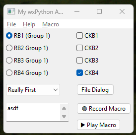

=====
Adventures in wxPython
=====

The toy application:  I originally started writing this to test out the
wx.UIActionSimulator.  Wanted to create some hotkeys and the ability for users
to create their own macros.

Well this changed as it turned out the the Command / CommandProcess were the
wxPython way to create macors, and accelerator tables were the way to implement
the hotkeys I wanted

HotKeys / Accelerator table
---------------------------
Some useful links

https://wxpython.org/Phoenix/docs/html/wx.AcceleratorEntry.html

Mouse vs Python
https://blog.pythonlibrary.org/2017/09/28/wxpython-all-about-accelerators

Menus create EVT_MENU events, and if in there creating you inclide a \tAlt+W,
it also creates a HotKey to trigger the menu item directly.

Other widgets to not fire an EVT_MENU; however, it is possible to connect a EVT_MENU
created by a HotKey and the widgets event handler.

See the example code below for a brief example:

1        ID_ALT_W =wx.NewIdRef()

2        ID_ALT_M = wx.NewIdRef()

3        self.Bind(wx.EVT_MENU,
                  lambda evt: as_test.core.macro_widget.on_txtctrl_lost_focus(self.mult_line_tx, evt),
                  id=ID_ALT_W)
4        self.Bind(wx.EVT_MENU,
                  lambda evt:  as_test.core.macro_widget.on_record(self.record_btn, self.playback_btn, evt),
                  id=ID_ALT_M)

5        self.accel_table = wx.AcceleratorTable([(wx.ACCEL_ALT, ord('W'), ID_ALT_W),
                                                (wx.ACCEL_ALT, ord('M'), ID_ALT_M),
                                                ])

6        self.SetAcceleratorTable(self.accel_table)

A non-menu  item; such as a HotKey or Widget's handler can be connect to a wx.EVT_MENU.  The linkage is
by a common ID reference.

Line 1 above creates such an ID to link a wx.TextCtrl to a wx.EVT_MENU and the textctrl's handler.

Line 3 shows the Binding of the EVT_MENU to the on.txtctrl_lost_Focus handler.
Here have used a lambda function to pass both widget and the event to its handler.  The 'id='
is the tie between the widget and the accelorator table for the HotKey 'Alt+W'.

So now entering text into the textctrl and then tabbing out or clicking on anything
else will trigger the control's handler, as will the hotkey 'Alt+W'

Line 2 is the second example for button widget.  Clicking the button toggles between

"🔴 Record Macro"

and "⏹ Stop Recording"

Line 2 creates the linking reference ID used for the hotkey link in line 4
and the table entry in line 5.  Here the lambda passes two objects the record and play back buttons.
The handler for the record botton toggles itself as above but also disables the play
playback button while macor recording is in progress, anb enables when the recording is stopped.

So allowing the hotkey 'Alt+M' to do the same.

The lambda technique of passing multiple arguments to the widget's event
handler was taught to me via the CoPilot AI

